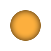
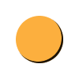
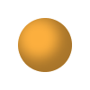

# AWT Painter

CSS-like effects brought to Java shape painting.

Helps to decouple shapes and their styles allowing developer to concentrate on positioning rather than drawing.

## Contents

1. [Quick Start](#quick-start)
2. [Shadows](#shadows)
    1. [Inner Shadow](#inner-shadow)
    2. [Drop Shadow](#drop-shadow)
3. [Background](#background)
4. [Outlines](#outlines)
5. [Painter Ordering](#painter-ordering)
6. [License](#license)

## Quick Start

Use `org.ehony.awt.ShapePainter` to access fluent api for drawing shapes.

## Bundled Painters

AWT Painter provides several classes which implement CSS-like effects.

Exemples below use fllowing objects:
```java
ShapePainter shapePainter = new ShapePainter();
Shape shape = new Rectangle(20, 20, 60, 60);
```

### Shadows

This section describes bundled painters which provide same effects as CSS [`box-shadow`][1] property.

#### Inset Shadow

`org.ehony.awt.painter.InsetShadowPainter` is analogue [`box-shadow`][1] property _with_ `inset` keyword specified.

Default shadow settings match ones defined in CSS specification. Inset shadow with all parameters set to zero paints nothing.


Example | Description
 --- | --- 
 | **Blur Radius**<br/> Positive blur radius indicates that the resulting shadow should be blurred. If the blur value is zero or negative, the edge of the shadow is sharp. By default shadow is blurred with parallelized implemetation of [Gaussian blur](http://en.wikipedia.org/wiki/Gaussian_blur).<br/> <code>decorator.background(0xfffcaf3e).insetShadow(0, 0, <strong>15</strong>, 0, 0xcc000000);</code>
 | **Offset**<br/> Horizontal and vertical offsets can be specified separately. A positive value draws a shadow that is offset to the right (bottom) of the box, a negative length to the left (top).<br/> <code>decorator.background(0xfffcaf3e).insetShadow(0, <strong>-5</strong>, <strong>10</strong>, 0, 0xaa000000);</code>
 | **Spread**<br/> Positive values cause the shadow to expand in all directions by the specified value. Negative values cause the shadow to contract.<br/> <code>maestro.background(0xfffcaf3e).insetShadow(0, 0, 15, <strong>-15</strong>, 0xcc000000);</code>
 | **Paint**<br/> Shadow may be painted with an arbitrary [`java.awt.Paint`](http://docs.oracle.com/javase/6/docs/api/java/awt/Paint.html). If the paint was not specified then paint returned by [`Graphics2D.getPaint()`](http://docs.oracle.com/javase/6/docs/api/java/awt/Graphics2D.html#getPaint()) is used.<br/> To create a gradient inset shadow create a custom `GradientPaint` instance:<br/> `gp = new GradientPaint(0, 0, new Color(0xfcaf3e), 60, 60, new Color(0x4e9a06));`<br/> And use it to paint an inset shadow:<br/> <code>maestro.background(Color.WHITE).insetShadow(0, 0, 15, 0, <strong>gp</strong>);</code>


#### Drop Shadow

`org.ehony.awt.painter.DropShadowPainter` is analogue [`box-shadow`][1] property _without_ `inset` keyword specified.

This painter inherits all the parameters from [inner shadow](#inner-shadow) and introduces:

<table>
<thead>
<tr>
    <th>Output</th>
    <th>Description</th>
</tr>
</thead>
<tbody>
<tr>
    <td></td>
    <td>
<b>Blur Radius</b>
<pre>
new ShapePainter()
    .background(new Color(0xfcaf3e))
    .dropShadow(0, 0, 10, 0, new Color(0xcc000000, true), false)
    .paint(shape, g);
</pre>
Positive blur radius indicates that the resulting shadow should be blurred. If the blur value is zero or negative, the edge of the shadow is sharp. By default shadow is blurred with parallelized implemetation of <a href="http://en.wikipedia.org/wiki/Box_blur">box blur</a> filter.
    </td>
</tr>
<tr>
    <td></td>
    <td>
<b>Offset</b>
<pre>
new ShapePainter()
    .background(new Color(0xfcaf3e))
    .dropShadow(5, 5, 10, 0, new Color(0x99000000, true), false)
    .paint(shape, g);
</pre>
Horizontal and vertical offsets can be specified separately. A positive value draws a shadow that is offset to the right (bottom) of the box, a negative length to the left (top).
    </td>
</tr>
<tr>
    <td></td>
    <td>
<b>Spread</b>
<pre>
new ShapePainter()
    .background(new Color(0xfcaf3e))
    .dropShadow(6, 12, 6, -12, new Color(0xcc000000, true), false)
    .paint(shape, g);
</pre>
Positive values cause the shadow to expand in all directions by the specified value. Negative values cause the shadow to contract.
    </td>
</tr>
<tr>
    <td></td>
    <td>
<b>Paint</b>
<pre>
Paint paint = new GradientPaint(
        0, 0, new Color(0xfcaf3e),
        60, 60, new Color(0x4e9a06));
new ShapePainter()
    .background(Color.WHITE)
    .dropShadow(-2, -2, 15, 4, paint, false)
    .paint(shape, g);
</pre>
Shadow may be painted with an arbitrary <code>java.awt.Paint</code>. If the paint was not specified then paint returned by <code>Graphics#getPaint()</code> is used.
    </td>
</tr>
<tr>
    <td></td>
    <td>
<b>Exclude Original Shape</b>
<pre>
new ShapePainter()
    .dropShadow(0, 0, 10, 0, new Color(0xee000000, true), true)
    .paint(shape, g);
</pre>
If set to <code>true</code> omits painting shadow pixels which overlap with original shape.
    </td>
</tr>
</tbody>
</table>

### Background

`org.ehony.awt.painter.BackgroundPainter` is analogue of [`background`](http://www.w3.org/TR/css3-background/#background) property.

### Outlines

`org.ehony.awt.painter.OutlinePainter` is analogue of [`outline`](http://www.w3.org/TR/CSS21/ui.html#dynamic-outlines) property.

Default outline settings match ones defined in CSS specification. Outline painter does not have any required parameters but may be configured with:

**Width** The width of the outline. The width must be greater than or equal to zero. If width is set to zero, outline is not painted.

**Cap** If shape being drawn is an open path instance this property defined the decoration of the ends of an outline.

**Line Join** Defines the decoration applied where path segments meet.

**Miter Limit** The limit to trim the miter join, must be greater than or equal to 1.

**Dash Pattern** Pattern of empty and painted areas of an outline.

**Initial Dash Phase** The offset to start the dashing pattern.

**Subsequent Dash** If set to `false` then `getSubsequentShape(Shape)` method would return shape ignoring the dash pattern. This may be useful if multiple outline painters are used allowing to prohibit consequent outlines to bend around each other dashes.

## Painter Ordering

`org.ehony.awt.painter.CompositePainter` description.

## License

The code is available under [MIT licence](LICENSE.txt).

[1]: http://www.w3.org/TR/css3-background/#box-shadow
